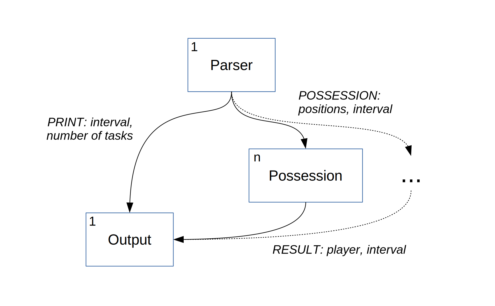

# MPI Project: Design Document

## The problem
We have to develop a system to give real-time statistics about ball possession in a soccer match.

The statistics must be computed using data provided by a number of wireless sensors, which record the positions of the players' shoes and the balls used in the game.

The sensors send updates at a quick and constant rate (200 Hz for the shoes, 2000 Hz for the balls), and the updated possession statistics must be outputted at fixed time intervals.

## Design
### Parsing the streams
The sensor data for this project was provided as a text file.
Additional event regarding interruptions (like fouls or out-of-field balls) were also provided as two different text files, one for each game half.

We parse the event files sequentially, to simulate actual real-time data streams.

### Computing possession statistics
We want to compute ball possession statistics for each player and for each team.

Following the assignment instructions, we define a player as one "having possession of the ball" if the player is the one closest to the ball, while also being closer than K meters (where K is a value provided in input).

To generate statistics, we sample the game time at a fixed rate. We study the position of each player respective to the ball in discrete "instants" of the game. For every instant where a player is found to have possession of the ball, a counter specific for the player is increased. Statistics for each player can then be computed by taking the ratio of the player's possession counter over the total of all the players' counters.

We chose to use the ball's position updates as triggers for the computation of possession, i.e. they identify the "instants" in which we split the game. We think that this choice is reasonable since these updates are supposed to be sent at a constant rate. Furthermore, despite the high refresh rate, every time the ball changes position the player with possession might change too, and a new check for who has possession makes sense.

Using the ball updates requires some caution, since the ball in play changes from time to time and the amount of time which passes from one update to another might be desyncronized; in practice though this is not a problem since ball swaps are quite rare compared to the sampling rate.

### Handling the updates
#### Position events

We have three type of position events:

  - player position
  - ball position
  - referee position

We discard the referee position updates since they have no effect on ball possession.

The last known position of each player is saved in a dedicated array, and updated at every player position update. The ball position on the other hand is not saved, since it is only used to check who has possession of the ball for that instant.

During the game four different balls are used, each one equipped with a single sensor. Each of these four sensors never stops sending position updates, even when they are not actually used in the game. To distinguish the ball in play from the ones that are not, we simply check if the position of the ball falls inside the boundaries of the field. The balls that are not currently used are usually kept outside of the field.

#### Game interruptions
A separate stream gives updates about game interruptions. We discard every position update with a timestamp that falls inside an interruption. Nonetheless, during a game interruption our program doesn't stop from printing statistics at regular intervals.

### Output
The assignment asks us to output possession statistics at regular intervals. Since the data we have available is not an actual real-time stream, we can't use a real clock to decide when to output the updated statistics.

Instead we check the timestamp of every update, and print the statistics for an interval when all the events for an interval have been read, i.e. the first time we find an update with a timestamp which follows the end of the interval.

## Parallelization
Due to the way the problem is defined, not everything can be parallelized.

- Events must be parsed sequentially, like they were real-time events.
- The moment a possession check is triggered, every player's position must be accurate. This means that the positions must be kept updated, and it must be done sequentially to avoid out-of-order updates.
- The computation of the minimal distance *can* theoretically be parallelized, but it's not worth it in practice since there are only 16 players and the overhead is not negligible.
- The possession check of different "instants" in the same output interval can be done simultaneously and parallelized.
- The possession statistics must be aggregated at the end of each output interval.

### Choice of framework
Between MPI and OpenMP, we found MPI to be more appropriate for this problem.

The message passing interface is much easier to use to dispatch an arbitrary number of tasks to different processes, like the possession computations for different instants. MPI also makes it simpler to define a pipeline and having clearly separate jobs for each process, which we need since parsing and outputs must be sequential.

### Processes
We chose to define three classes of processes among which to split the work.

1. A single **parser** process, which parses the streams, updates positions and triggers the computation of who has possession for every instant;
2. a single **output** process, which aggregates the result of the possession computations, and regularly outputs the requested statistics;
3. a variable number of **possession** processes, which handle the task of finding the player who has possession of the ball for specific instants, and send the results to the output process.

A higher number of possession processes mean that the work of computing possession for different instants in an interval can be done simultaneously. The results are collected in an arbitrary order by the output process.

### Communication and behaviour
To produce coherent results, the processes have to be handled carefully.

- Every time a position update is read, the parser process will send a message containing all the updated player positions for the current interval to the first free possession process. The parser process keeps an updated counter of how many tasks it has spawned during an interval.
- The possession processes will simply find which player has possession of the ball in the specified instant, given the data received from the parser process. The result is sent to the output process along with the identifier for the interval.
- When an interval has ended, the parser will send a message to the output process to trigger an output. The message will contain the interval identifier and the total amount of possession computations that have been launched.
- The output process, at any given time, will collect and accumulate the results sent by the possession processes for the current interval. On receiving the end of interval message from the parser, the output process will wait for the number of remaining results that are still missing for the interval, then print the complete statistics.

Since the output process knows the exact number of tasks that have been spawned for each interval, we're sure that no message from the possession process will remain uncollected.

An "end-of-game" message sent from the parser closes all processes when the game has finished.

